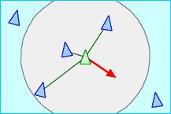

# Flocking Simulation

1. [Introduction](#introduction)
2. [Rules](#rules)
3. [Implementation](#implementation)
4. [Change log](#change-log)

## Introduction
In 1986 Craig Reynolds made a computer model of coordinated animal motion such as bird flocks and fish schools. It was based on three dimensional computational geometry of the sort normally used in computer animation or computer aided design. He called the generic simulated flocking creatures boids. The basic flocking model consists of three simple steering behaviors which describe how an individual boid maneuvers based on the positions and velocities its nearby flockmates (see [Rules](#rules)).

## Rules
| Illustration                                                                        | Rule                                                                        |
| ----------------------------------------------------------------------------------- | --------------------------------------------------------------------------- |
|  | **Separation**: steer to avoid crowding local flockmates                    |
|    | **Alignment**: steer towards the average heading of local flockmates        |
|      | **Cohesion**: steer to move toward the average position of local flockmates |

Please visit this [link](http://www.red3d.com/cwr/boids/) for more. All credits to Craig Reynolds.

## Implementation
The main class is the [Boid](boid.py) class. It basically handles *all* the computation needed for the Craig Reynolds' model. The 3 forces mentionned above are calculated, we limit the force and make all boids move at a certain velocity. Then we apply some coefficients and we add up in acceleration. The coefficients can be modified when the [main](main.py) program is running.

The Vector and Engine classes are an *elegant* way to make formulas easier and to modify on the go some coefficients. They can now be accessed under [Phoenyx - Pygame Engine](https://pypi.org/project/phoenyx) since v.2.  Since v1.2, the [quadtree](quadtree.py) space structure is used to bring back the $O(n\ln{n})$ complexity.

## Change log
1.  v0.1 : first boid drawn on the screen (yay !)
2.  v0.2 : force computation
3.  v0.3 : perception radius
<<<<<<< HEAD
4.  v0.4 : boids dont' see what's behind them
5.  v0.5 : ~~[Vector](vector.py) class~~
=======
4.  v0.4 : boids don't see what's behind them
5.  v0.5 : [Vector](vector.py) class
>>>>>>> 71629ab8d158007a08f53d515b988f904603e926
6. ~~v1.0 : [Slider](slider.py) class~~
7.  v1.1 : changed the Vector class and perception formula
8.  v1.2 : [Quadtree](quadtree.py) acceleration
9.  v2.0 : ~~brand new [Vector](vector.py) class~~
10. v2.1 : minor changes and drawing-bug fix
11. v3.0 : ~~integration of the [Engine](engine.py) file~~
12. v3.1 : refractor
<<<<<<< HEAD
13. v3.2 : Vector and Engine from [Phoenyx - Pygame Engine](https://pypi.org/project/phoenyx)
=======
13. v3.2 : made Boids look for flockmates trough window edges
>>>>>>> 71629ab8d158007a08f53d515b988f904603e926
